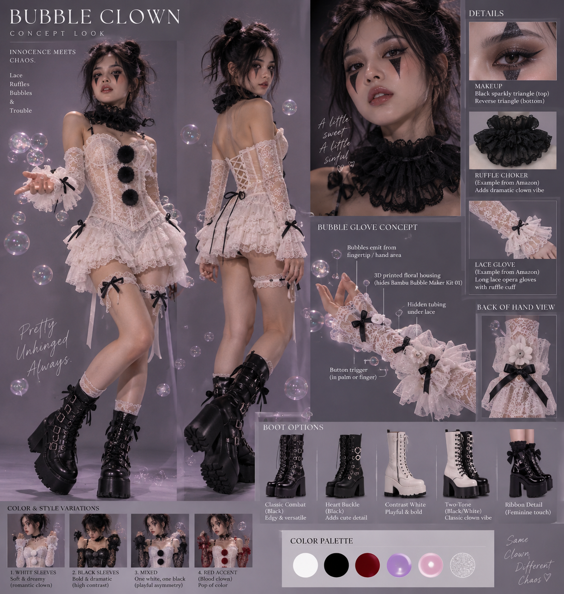

# Design Direction

**BUBBLE CLOWN — "Innocence meets chaos."** White lace, ruffles, black bows and
pom-poms, harlequin eye makeup, platform combat boots. Bubbles firing from the
fingertips of long lace opera gloves.

Source board: [design/concept-look.png](design/concept-look.png)

---

## What the concept locks in

| Element | Decision |
|---|---|
| Gloves | Long white lace opera gloves with ruffle cuff |
| Bubble housing | 3D printed floral piece on the back of the hand, hiding the kit |
| Tubing | Routed under the lace |
| Trigger | Palm or finger mounted |
| Emit point | Fingertip / hand area |
| Palette | White, black, deep red, lavender, pink, iridescent |
| Variations | 1 white / 2 black / 3 mixed / 4 red accent sleeves |

Several of these agree with what's already in [BUILD.md](BUILD.md): the trigger is
palm-mounted (Step 5), and the **ruffle cuff is exactly where the wrist SM-5
connector wants to live** — 3–4 cm above the crease, hidden under the ruffle, with
the service loop tucked inside it (Step 3). That's a free win.

One of them is better than it looks. **"Tubing routed under the lace" assumes the
bottle is somewhere other than the blower head** — which is precisely what the kit
turns out to support, and precisely what Mount C does (Step 7). The concept board
got there before the teardown did. If the hose test passes, the bottle goes on the
forearm under the sleeve and only the floral housing sits on the hand.

Three things don't agree, and they matter.

---

## 1. Lace doesn't diffuse — it reveals

The build notes assume thin opaque fabric that scatters the light into a smooth
glow. **Lace is open mesh.** Light passes straight through the holes, so the strip
stays visibly a strip: a hard bright line with dots, not a glow.

Two ways to go:

- **Lean in.** A crisp glowing line under lace reads as deliberate — circuitry
  under something delicate, which is on-theme for "innocence meets chaos."
- **Diffuse it properly.** Add a layer between the strip and the lace: thin white
  organza, tulle, or a frosted silicone LED diffuser channel. This gives the soft
  glow the original plan assumed, with the lace pattern silhouetted on top.

My read is the second is closer to the board's mood — everything in it is soft
edges and layered sheer — but this is a taste call, and it's cheap to test both.
Do it with a scrap before the gloves are cut into.

**This supersedes the "thin, pale, stretchy" fabric guidance for the glove itself**
in [PARTS.md](PARTS.md) and [BUILD.md](BUILD.md) step 10. Lace is pale but it is not
a diffuser. Those documents describe the *electrical* requirement; this one overrides
the *material* choice.

---

## 2. The black-sleeve variations fight the lighting

Variation 2 (both sleeves black) and variation 3 (one white, one black) are the
problem. **Black lace swallows the light almost entirely** — that's the exact
failure the fabric test in Step 10 is meant to catch.

Options, least to most disruptive:

- **Variation 1 or 4** for any look where the lights need to read. Red accent
  still works; the sleeves are white.
- **Mount outside the lace** on the black arm, with the strip disguised as trim.
- **Accept the asymmetry** — one glowing arm, one dark arm, as a deliberate
  "same clown, different chaos" thing. Fits the board's own tagline.

What I'd avoid: cranking brightness on just the black arm. That breaks the
one-identical-binary property both arms currently share, and it still won't look
like the white side.

---

## 3. Where the controller and battery actually go

**This is the real open problem.** The build assumes a pod on the upper arm, above
the soap spray. But this costume is off-shoulder with sheer lace over the upper
arm — there's nothing opaque to hide a pod and an 18650 behind.

Candidate answers:

- **Disguise the pod as costume trim.** The design already has black pom-poms down
  the corset and black bows at the cuffs, garters and shoulders. A black lump on
  the upper arm reads as intentional if it's shaped like one more pom-pom or bow.
  This is my pick — it hides the hardware in plain sight and needs no new visual
  vocabulary.
- **Garter-mounted**, using the existing lace leg garters. Costs a cable run from
  thigh to hand, which is awkward across the hip and easy to snag.
- **Corset-back pouch.** Most capacity, but it's a long cable run per arm and
  reintroduces exactly the torso wiring the two-independent-arms design avoids.

Still needs deciding before the pod enclosure gets printed.

---

## Lighting to match the palette

FastLED hues (`THEME_HUE`, 0–255) that sit in the board's palette:

| Look | Hue |
|---|---|
| Lavender | 180–192 (current default is 192) |
| Pink | 225–235 |
| Blood red, for variation 4 | 0–4 |
| Cold white | any hue, saturation 0 |

**Worth building: an iridescent comet.** The palette's sixth swatch is a soap-bubble
iridescent, and the costume is literally about bubbles. Instead of one fixed hue,
drift the comet's hue across a narrow lavender-to-pink band as it travels, so it
shimmers the way a bubble surface does. The comet already shifts saturation along
its path, so this is a small change in `renderFiring()`.

The floral housing is another opportunity: print it in **translucent white** PETG
or PLA and let the last pixel or two sit inside it. The flower then lights up from
within at the moment the bubbles fire.

---

## Open questions

- [ ] Diffuser layer under the lace, or leave the strip line visible?
- [ ] Which sleeve variation is the primary build?
- [ ] Where does the controller pod live?
- [ ] Translucent floral housing with an internal pixel — yes or no?
- [ ] Fixed hue or iridescent drift?
- [ ] Does the floral housing hide the **blower head alone** (Mount C) or the whole
      bottle (Mount A)? Blocked on the hose test in [BUILD.md](BUILD.md) step 7 —
      and Mount C makes the housing much smaller and lighter
- [ ] Can the ruffle cuff hide the SM-5 plug without pressing it into your wrist?
