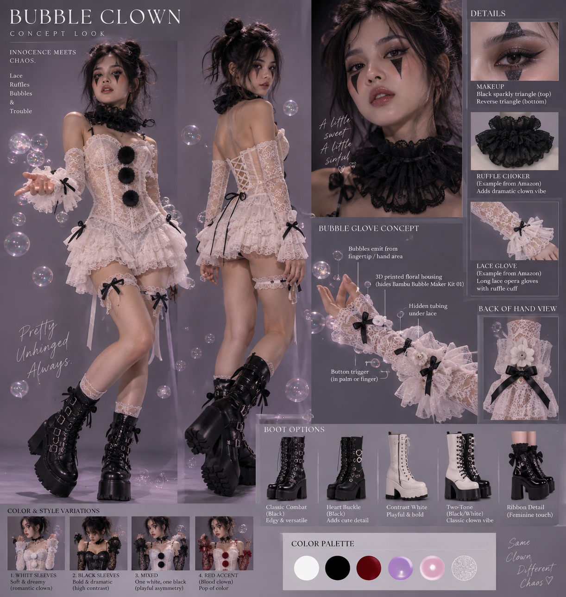
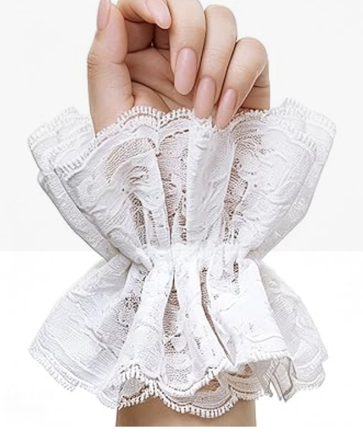

# Design Direction

**BUBBLE CLOWN — "Innocence meets chaos."** White lace, ruffles, black bows and
pom-poms, harlequin eye makeup, platform combat boots. Bubbles firing from the
fingertips of long lace opera gloves.

Source board: [design/concept-look.png](design/concept-look.png)

---

## What the concept locks in

| Element | Decision |
|---|---|
| Gloves | Long white lace opera gloves with ruffle cuff |
| Bubble housing | 3D printed floral piece on the back of the hand, hiding the kit |
| Tubing | Routed under the lace |
| Trigger | Palm or finger mounted |
| Emit point | Fingertip / hand area |
| Palette | White, black, deep red, lavender, pink, iridescent |
| Variations | 1 white / 2 black / 3 mixed / 4 red accent sleeves |

Several of these agree with what's already in [BUILD.md](BUILD.md): the trigger is
palm-mounted (Step 5), and the **ruffle cuff is exactly where the wrist plugs
(SM-3 + SM-4) want to live** — 3–4 cm above the crease, hidden under the ruffle,
with the service loop tucked inside it (Step 3). That's a free win.

One of them is better than it looks. **"Tubing routed under the lace" assumes the
bottle is somewhere other than the blower head** — which is precisely what the kit
turns out to support, and precisely what Mount C does (Step 7). The concept board
got there before the teardown did. If the hose test passes, the bottle goes on the
forearm under the sleeve and only the floral housing sits on the hand.

Three things don't agree, and they matter.

---

## 1. Lace doesn't diffuse — it reveals

The build notes assume thin opaque fabric that scatters the light into a smooth
glow. **Lace is open mesh.** Light passes straight through the holes, so the strip
stays visibly a strip: a hard bright line with dots, not a glow.

Two ways to go:

- **Lean in.** A crisp glowing line under lace reads as deliberate — circuitry
  under something delicate, which is on-theme for "innocence meets chaos."
- **Diffuse it properly.** Add a layer between the strip and the lace: thin white
  organza, tulle, or a frosted silicone LED diffuser channel. This gives the soft
  glow the original plan assumed, with the lace pattern silhouetted on top.

My read is the second is closer to the board's mood — everything in it is soft
edges and layered sheer — but this is a taste call, and it's cheap to test both.
Do it with a scrap before the gloves are cut into.

**This supersedes the "thin, pale, stretchy" fabric guidance for the glove itself**
in [PARTS.md](PARTS.md) and [BUILD.md](BUILD.md) step 10. Lace is pale but it is not
a diffuser. Those documents describe the *electrical* requirement; this one overrides
the *material* choice.

---

## 2. The black-sleeve variations fight the lighting

Variation 2 (both sleeves black) and variation 3 (one white, one black) are the
problem. **Black lace swallows the light almost entirely** — that's the exact
failure the fabric test in Step 10 is meant to catch.

Options, least to most disruptive:

- **Variation 1 or 4** for any look where the lights need to read. Red accent
  still works; the sleeves are white.
- **Mount outside the lace** on the black arm, with the strip disguised as trim.
- **Accept the asymmetry** — one glowing arm, one dark arm, as a deliberate
  "same clown, different chaos" thing. Fits the board's own tagline.

What I'd avoid: cranking brightness on just the black arm. That breaks the
one-identical-binary property both arms currently share, and it still won't look
like the white side.

---

## 3. Where the controller and battery actually go

**This is the real open problem.** The build assumes a pod on the upper arm, above
the soap spray. But this costume is off-shoulder with sheer lace over the upper
arm — there's nothing opaque to hide a pod and an 18650 behind.

**And "above the spray" no longer survives contact with a rave.** Arms go up, so
solution runs *down* the arm at the pod, and the air is full of atomised soap
regardless. The pod has to be a sealed, drained box wherever it ends up — see
[BUILD.md](BUILD.md) step 11. That changes what we're hiding: not a bare board and
a cell, but a PETG box with a gasketed lid, a booted switch on the outside, and
wires leaving the underside in drip loops.

Two things this adds to the concealment problem:

- **The disconnect switch has to be reachable through the costume**, one-handed,
  without opening anything. It can be disguised — a switch under a bow reads as
  trim — but it cannot be buried.
- **Openings face down.** Whatever trim hides the pod must not close off its drain
  hole or its cable entry, or it becomes a sponge held against the box.

Candidate answers:

- **Disguise the pod as costume trim.** The design already has black pom-poms down
  the corset and black bows at the cuffs, garters and shoulders. A black lump on
  the upper arm reads as intentional if it's shaped like one more pom-pom or bow.
  This is my pick — it hides the hardware in plain sight and needs no new visual
  vocabulary. **Trim over a box, not trim instead of a box**: a pom-pom skirt
  around a sealed PETG pod, with the underside left clear to drain and the switch
  poking through a slit.
- **Garter-mounted**, using the existing lace leg garters. Costs a cable run from
  thigh to hand, which is awkward across the hip and easy to snag.
- **Corset-back pouch.** Most capacity, but it's a long cable run per arm and
  reintroduces exactly the torso wiring the two-independent-arms design avoids.

Still needs deciding before the pod enclosure gets printed.

---

## Lighting to match the palette

FastLED hues (`THEME_HUE`, 0–255) that sit in the board's palette:

| Look | Hue |
|---|---|
| Lavender | 180–192 (current default is 192) |
| Pink | 225–235 |
| Blood red, for variation 4 | 0–4 |
| Cold white | any hue, saturation 0 |

**Worth building: an iridescent comet.** The palette's sixth swatch is a soap-bubble
iridescent, and the costume is literally about bubbles. Instead of one fixed hue,
drift the comet's hue across a narrow lavender-to-pink band as it travels, so it
shimmers the way a bubble surface does. The comet already shifts saturation along
its path, so this is a small change in `renderFiring()`.

The floral housing is another opportunity: print it in **translucent white** PETG
or PLA and let the last pixel or two sit inside it. The flower then lights up from
within at the moment the bubbles fire.

---

## The wrist cuff

Reference: [design/wrist-cuff-reference.png](design/wrist-cuff-reference.png) —
a separate stretch-lace cuff, not part of the glove. Elastic gathered band at
the wrist crease, two ruffle tiers: one flares down over the back of the hand,
one flares up the forearm.

**Yes — and the double flare is what makes it work.** The old open question was
whether a ruffle cuff could hide the wrist plugs without pressing them into the
wrist. This shape answers it, because it separates the two jobs:

- **Tight part (elastic band):** sits *at the crease*. Nothing rigid under it.
- **Loose part (upper ruffle):** drapes over the 3–4 cm zone above the crease —
  exactly where the SM-3 + SM-4 mate ([BUILD.md](BUILD.md) step 3).
- So the plugs sit **above the band, under the upper ruffle**: covered, not
  compressed. The "plugs above the cuff" rule (step 11) was about a tight cuff
  channeling solution into the shells — a loose flare sheds drips off its hem
  instead. Grease + silicone tape stay the real waterproofing; the cuff is
  costume, not sealing.
- Drip behaviour, both arm positions:
  - arm down → solution runs toward the hand → **upper ruffle** sheds it past
    the plugs
  - arm up → solution runs toward the elbow → **lower ruffle** sheds it past
    the housing straps

**Build it as a separate piece, like the reference.** Then the de-glove order
still works: cuff off → unwrap plug tape → unplug SM-3 + SM-4 → glove off.
Nothing rigid bridges the wrist. Make spares — it's the easiest part of the
costume to duplicate, and it *will* get soaked (lace wicks).

### What crosses the wrist under it, and how each one mounts

| Item | Where it ends up |
|---|---|
| SM-3 + SM-4 mated plugs | On the forearm, 3–4 cm above the crease, pointing down, under the **upper** ruffle. Unchanged from step 3 |
| Strip umbilical + service loop | Under the cuff. The ~8 cm dark pixel gap hides under the ruffle — free win, now even on **black** cuffs: no light needs to pass here, so variations 2/3 can keep black lace at the cuff at no cost |
| 4-wire motor/trigger run | Under the band, flat against the glove. Wires take the squeeze fine |
| Hose (Mount C, forearm bottle) | **Does not take the squeeze fine.** See below |
| Bubble housing wrist tongue + 11 mm Velcro strap | **Lower** ruffle drapes over it — the strap disappears |
| Bottle on the forearm (Mount C) | Above the upper ruffle's hem. The hem overlaps the bottle strap's lower edge and hides it |
| Trigger ZH lead | Inside the glove to the palm; the cuff never touches it |

### The hose gate

- The blower pulls solution by suction. An elastic band squeezing the 3 × 5 mm
  silicone hose flat = starved bubbler.
- Fix: sew a **short non-stretch flat section into the band** — ribbon, ~2 cm —
  on the back of the wrist, and route the hose under that. No squeeze at that
  one point, stretch everywhere else.
- The concept board's **black bow at the cuff** goes right on top of the gate.
  It hides the one flat spot and the hose bump under it.
- If fabric alone can't hold the hose open, a small printed pass-through
  bridge sewn into the band is the fallback — don't design it until the ribbon
  version fails.

### Lower ruffle: two hems to respect

- **Must cover:** the housing's wrist tongue and its Velcro strap (tongue is
  36 mm long — a hem ~40 mm past the band does it).
- **Must NOT reach:** the shroud's top vent slots (blower starves) or the
  spinning bubble ring (lace in the wand wheel = snag, wick, jam). Check at the
  housing fit test; tack the hem corners down if it creeps.
- Mount A fallback (bottle on the hand) makes the lump under this ruffle much
  bigger — if the hose test fails, re-check both hems over the real bottle.

---

## Open questions

- [ ] Diffuser layer under the lace, or leave the strip line visible?
- [ ] Which sleeve variation is the primary build?
- [ ] Where does the controller pod live?
- [ ] Translucent floral housing with an internal pixel — yes or no?
- [ ] Fixed hue or iridescent drift?
- [ ] Does the floral housing hide the **blower head alone** (Mount C) or the whole
      bottle (Mount A)? Blocked on the hose test in [BUILD.md](BUILD.md) step 7 —
      and Mount C makes the housing much smaller and lighter
- [x] Can the ruffle cuff hide the wrist SM-3 + SM-4 plugs without pressing them
      into your wrist? **Yes — double-flare cuff, tight only at the crease; plugs
      sit above the band under the loose upper ruffle. See "The wrist cuff"**
- [ ] Hose gate: does a 2 cm non-stretch ribbon section in the band keep the
      3 × 5 hose open under suction? (Only matters if Mount C wins the hose test)
- [ ] Lower ruffle hem: clears the shroud vents and the ring with the fingers
      curled? Check at the bubble-housing fit test
- [ ] How does the disconnect switch read as costume? A bow over the 20 mm round
      rocker (the booted toggle became a KCD1 rocker — see PARTS.md), or something
      more deliberate?
- [ ] Does the pod's drain hole survive whatever trim goes over it?
