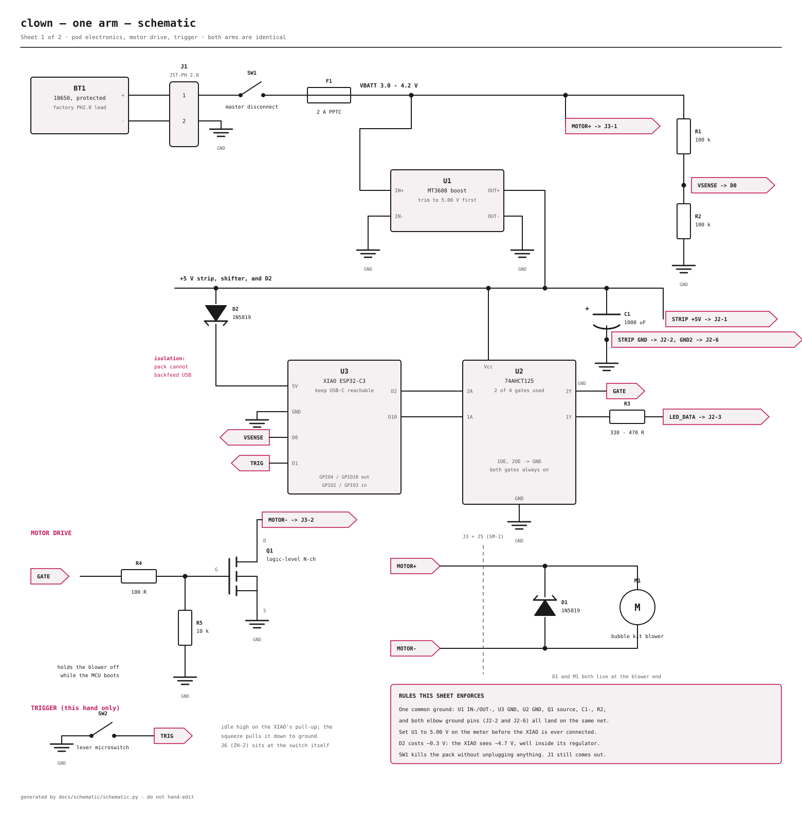
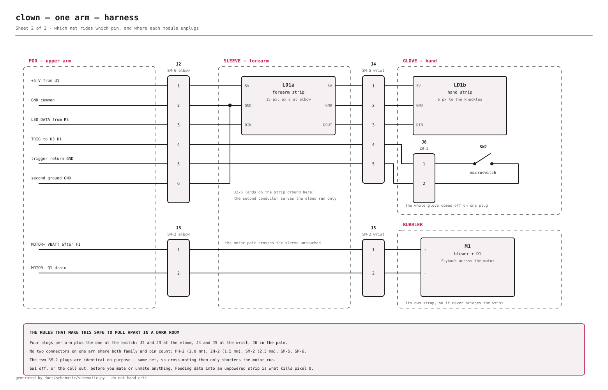

# Schematic

The electrical drawing for **one arm**. The other arm is identical — same parts,
same pinout, same firmware.

Two sheets, both generated from [docs/schematic/schematic.py](docs/schematic/schematic.py):

- **Sheet 1 — schematic.** The pod electronics, the motor drive, the trigger
- **Sheet 2 — harness.** Which net rides which pin, and where each module unplugs

Prose for the same information lives in [BUILD.md](BUILD.md) step 4 (pod) and
[PARTS.md](PARTS.md) (why each part is there). This file is the reference drawing —
if the two ever disagree, the drawing is what got reviewed.

---

## Naming rules

**These are requirements, not house style.** Anything added to the drawing, the
net table, or the prose in any other file has to keep them true.

1. **One name, one thing.** No designator, pin name, or net name refers to two
   different things anywhere in the design
2. **Diodes are `CR1` and `CR2` — never `D1`/`D2`.** The XIAO's silkscreen
   already owns `D0` through `D10`, so a `D` designator would collide with a
   pin. `CR` is the other standard diode prefix (IEEE 315 / ASME Y14.44). It
   also leaves `Q1 D` as the only "D" pin on the sheet
3. **A pin is never named on its own.** Write the owner first: `U3 GPIO4`,
   `U2 2A`, `J2-3`, `Q1 G`. Bare `GPIO4` or "pin 3" is not a name
4. **XIAO pins are named by GPIO number.** The silkscreen D-number appears in
   exactly two places — the silk map printed under `U3` on sheet 1, and the
   [pin map](#u3-pin-map) below — and always with the word *silk* beside it
5. **Nets are `UPPER_SNAKE`**, and no net shares a name with a designator or a
   pin. A flag on the drawing carries the net name and nothing else; where the
   net goes is a separate note beside it

`schematic.py` checks 1, 2 and 5 mechanically and refuses to generate if they
are broken — see `check_names()`. Rules 3 and 4 are on you.

> Earlier revisions of these docs called the flyback `D1` and the isolation
> Schottky `D2`, which read identically to the XIAO pins `D1` and `D2` — two of
> which are in this circuit, one of them being the motor PWM pin that drives
> that very MOSFET. That is the collision these rules exist to kill.

---

## Sheet 1 — schematic



How to read it:

- **Pink flags** are net labels, and carry the net name only. A wire ending in
  `GATE` continues at the other flag marked `GATE`. It is the same wire; it is
  drawn twice so the sheet stays readable. The grey line beside a flag says
  where that net leaves the pod — it is a note, not part of the name
- **Ground symbols** are all one net. There is exactly one ground in this design
- Rails are labelled on the line: `VBATT` is the cell after the disconnect and the
  fuse, `+5 V` is the boost output

### The four things on this sheet that the earlier docs did not have

| # | What | Why |
|---|---|---|
| **SW1** | Master disconnect in the cell positive, ahead of the fuse | Kills the pack in one motion, without fishing a plug out of a sealed pod |
| **CR2** | 1N5819 between the boost output and the XIAO 5V pad | The XIAO's 5V pad is tied straight to USB VBUS. Without CR2, a connected pack backfeeds the host port the moment you plug in to reflash |
| **R5** | 10 kΩ gate-to-source pulldown on Q1 | Between reset and `setup()`, `U3 GPIO4` floats. R5 is the only thing holding the blower off. If you bought a module, confirm it has one; most do not |
| **R4** | 100 Ω gate series resistor | Limits the gate-charging current spike out of the level shifter |

`CR2` costs about 0.3 V, so the XIAO sees ~4.7 V — comfortably inside its regulator.
**The strip is fed from the boost directly, not through CR2.** Only the MCU sits
behind the diode, so the strip keeps a full 5 V.

### The unused half of U2

The build uses two of the 74AHCT125's four gates. **The other two are not "spare",
they are inputs that must not float.** A floating CMOS input drifts around the
switching threshold, so the gate oscillates, and the chip draws far more current
than its datasheet promises — tens of milliamps instead of microamps, as heat,
forever, off a battery you are wearing.

| Pin | Tie to | Why |
|---|---|---|
| `3A`, `4A` | **GND** | Inputs. A defined level, either rail would do; ground is the convention |
| `3OE`, `4OE` | **Vcc** | Also inputs, and OE is active-low — high disables the output |
| `3Y`, `4Y` | **nothing** | Outputs. Leave them open. Never tie an output to a rail |

- `1OE` and `2OE` go to **GND**, which is what enables the two gates we do use
- Disabling the unused outputs rather than enabling them into open air is the
  conventional choice, and it means a stray probe on `3Y`/`4Y` can't fight anything

On the DIP-14 part the pins are `1OE` 1, `1A` 2, `1Y` 3, `2OE` 4, `2A` 5, `2Y` 6,
`GND` 7, `3Y` 8, `3A` 9, `3OE` 10, `4Y` 11, `4A` 12, `4OE` 13, `Vcc` 14 — **check
it against the datasheet for the package you actually bought**; a breakout board
renumbers everything.

---

## Sheet 2 — harness



- The four module boundaries are the dashed boxes. Every one of them unplugs
- The two strips are separate designators: `LD1` is the 15 px forearm run,
  `LD2` the 6 px hand run. They are one data chain — `LD1 DOUT` crosses the
  wrist on `J4-3` and arrives at `LD2 DIN`
- `J2-6` (the second ground) terminates in the sleeve, on the strip's ground. It
  exists to halve the drop on the longest run in the costume, not to reach the hand
- The motor pair crosses the sleeve untouched — it is deliberately not bundled with
  the data line

---

<!-- generated:nets -->

### Nets

| Net | What it is | Everything on it |
|---|---|---|
| `VBATT` | Cell positive, after SW1 and F1 | BT1 + · J1-1 · SW1 · F1 · U1 IN+ · R1 · J3-1 |
| `GND` | The one common ground. Everything returns here | BT1 − · J1-2 · U1 IN− · U1 OUT− · U3 GND · U2 GND · U2 1OE · U2 2OE · U2 3A · U2 4A · Q1 S · C1 − · C2 · R2 · J2-2 · J2-5 · J2-6 · LD1 GND · J4-2 · J4-5 · LD2 GND · J6-2 · SW2 COM |
| `+5V` | Boost output. Strip, level shifter, and CR2's anode | U1 OUT+ · U2 Vcc · U2 3OE · U2 4OE · C1 + · C2 · CR2 anode · J2-1 · LD1 5V · J4-1 · LD2 5V |
| `+5V_MCU` | Same 5 V, one Schottky drop down, MCU only | CR2 cathode · U3 5V |
| `VSENSE` | Half of VBATT, for the ADC | R1 · R2 · U3 GPIO2 |
| `LED_DATA_3V3` | MCU-level data, level shifter input | U3 GPIO10 · U2 1A |
| `LED_DATA` | 5 V data, through the series resistor, to the forearm strip | U2 1Y · R3 · J2-3 · LD1 DIN |
| `LED_DATA_HAND` | The same chain continued past the wrist | LD1 DOUT · J4-3 · LD2 DIN |
| `GATE_3V3` | MCU-level motor PWM, level shifter input | U3 GPIO4 · U2 2A |
| `GATE` | 5 V gate drive. R5 holds it down while the MCU boots | U2 2Y · R4 · R5 · Q1 G |
| `TRIG` | Trigger, idle high on the MCU's internal pull-up | U3 GPIO3 · J2-4 · J4-4 · J6-1 · SW2 NO |
| `MOTOR+` | Blower positive, straight off the cell | VBATT · J3-1 · J5-1 · CR1 cathode · M1 + |
| `MOTOR-` | Blower negative, switched by the MOSFET | Q1 D · J3-2 · J5-2 · CR1 anode · M1 − |

### Designators

| Ref | Part |
|---|---|
| `BT1` | Protected 18650, on its factory PH2.0 lead |
| `J1` | JST-PH 2.0 2-pin — cell to pod, and cell to charger |
| `SW1` | Master disconnect, in the cell positive |
| `F1` | 2 A PPTC resettable fuse |
| `U1` | MT3608 boost module, trimmed to 5.00 V |
| `CR2` | 1N5819 — USB isolation, cathode to the XIAO 5V pad |
| `C1` | 1000 uF electrolytic, at the elbow connector |
| `C2` | 0.1 uF ceramic, across U2 pin 14 and pin 7, at the chip |
| `R1, R2` | 100 k / 100 k battery-sense divider |
| `U3` | Seeed XIAO ESP32-C3 |
| `U2` | 74AHCT125 — gate 1 for LED data, gate 2 for the MOSFET gate, gates 3 and 4 tied off |
| `R3` | 330-470 R series resistor on the LED data line |
| `R4` | 100 R gate series resistor |
| `R5` | 10 k gate-to-source pulldown |
| `Q1` | N-channel logic-level MOSFET (AO3400 / IRLZ44N / RFP30N06LE) |
| `CR1` | 1N5819 flyback, across the motor, at the blower end |
| `M1` | Bubble kit blower motor |
| `SW2` | Lever microswitch, in the palm |
| `J2` | JST-SM 6-pin — elbow |
| `J3` | JST-SM 2-pin — elbow, motor |
| `J4` | JST-SM 5-pin — wrist |
| `J5` | JST-SM 2-pin — wrist, motor |
| `J6` | JST-ZH 1.5 mm 2-pin — at the microswitch |
| `LD1` | WS2812B forearm strip, 15 px, pixel 0 at the elbow |
| `LD2` | WS2812B hand strip, 6 px, to the knuckles |

### U3 pin map

The only place the XIAO's silkscreen numbers are written down. Everywhere else, a XIAO pin is named by its GPIO number, so that `CR1` and `CR2` are the only `D`-ish names left and they are the two diodes.

| Pin | Silkscreen | Net | What it does |
|---|---|---|---|
| `U3 GPIO2` | `D0` | `VSENSE` | ADC, battery divider midpoint |
| `U3 GPIO3` | `D1` | `TRIG` | Input, internal pull-up, switch pulls it low |
| `U3 GPIO4` | `D2` | `GATE_3V3` | Output, motor PWM into U2 2A |
| `U3 GPIO10` | `D10` | `LED_DATA_3V3` | Output, pixel data into U2 1A |
| `U3 5V` | `5V` | `+5V_MCU` | Power in, behind CR2 |
| `U3 GND` | `GND` | `GND` | The one ground |

<!-- /generated:nets -->

---

## Regenerating

Both SVGs and the three tables above are generated. Edit the script, never the SVGs:

```
python3 docs/schematic/schematic.py
```

No dependencies — it writes SVG text directly. The tables are rewritten in place
between the `generated:nets` markers, so the drawing and the tables cannot drift.
`check_names()` runs first and aborts the whole generate if a designator, net or
pin name has been reused; a broken name never reaches the drawing.

---

## What is deliberately not here

- **Mechanical.** Enclosure, gasketing, strap and sealing detail are
  [BUILD.md](BUILD.md) step 11
- **Firmware thresholds.** The low-battery warning and the low-voltage shutoff are
  in `firmware/clown_arm/clown_arm.ino`, in the tunables block
- **Layout.** There is no PCB. The pod is protoboard; sheet 1 is the circuit, not a
  placement

## Review checklist

If you are the engineer reading this, these are the things worth checking hardest:

- [ ] `CR2` orientation — cathode to the XIAO. Backwards, the board never powers
- [ ] `CR1` orientation — banded end to motor **+**. Backwards it is a dead short
      across the cell through the MOSFET
- [ ] `C1` polarity — stripe to ground
- [ ] `C2` present, and actually *at* `U2`'s pin 14 and pin 7 on short legs —
      `C1` is bulk at the strip and does not do this job
- [ ] `R5` present, and actually across gate–source rather than gate–ground on a
      module with a separate source pin
- [ ] `F1` ahead of everything, including `U1` and the motor tap
- [ ] The boost trimpot set to 5.00 V **before** the XIAO is connected
- [ ] `U2` `1OE`/`2OE` tied to ground, not left floating
- [ ] `U2` `3A`/`4A` to ground and `3OE`/`4OE` to Vcc — no unused input floating,
      and `3Y`/`4Y` left open rather than tied
