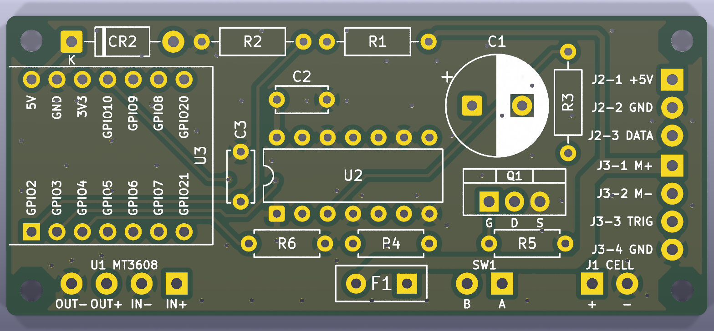

# Pod PCB

The pod circuit from the [perfboard layout](../layout/README.md) as a real
two-layer board. Same parts, same nets and same designators as
[SCHEMATIC.md](../../SCHEMATIC.md). Everything is through-hole and hand-soldered.



| File | What it is |
|---|---|
| [fab/clown-pod-gerbers.zip](fab/clown-pod-gerbers.zip) | **The upload for PCBWay.** Gerbers for copper, mask, silk and outline, plus Excellon drill files |
| [clown-pod.kicad_pcb](clown-pod.kicad_pcb) | The board, opens in KiCad 9 |
| [pod_pcb.py](pod_pcb.py) | The source: outline, placement, netlist, hand-routed power, silkscreen |
| [build.sh](build.sh) | Rebuilds everything: place, autoroute, ground pour, DRC, export |

## Before you order

Measure two parts. Nobody recorded their sizes, and the footprints assume them:

- **C1, the 1000 µF cap, must be 10 mm across or less**, with 5 mm lead pitch. A
  12.5 mm can hits U2, R3 and Q1. Use a 10 mm one from the electrolytic kit if
  the shelf part is bigger
- **F1, the polyfuse, must be about 10 mm wide or less**, with leads about 5 mm
  apart. Its outline is 9.1 mm

## Ordering on PCBWay

Upload `fab/clown-pod-gerbers.zip` as a standard PCB. The size and layer count
come from the files. Set these on the form; everything else stays at its
default:

| Setting | Value |
|---|---|
| Size / quantity | 70 × 30 mm, single pieces, 5 boards (the minimum: one per arm, three spares) |
| Layers | 2 |
| Material / thickness | FR-4, 1.6 mm |
| Copper | 1 oz |
| Min track / spacing | 0.3 mm / 0.4 mm. Well inside the standard 6/6 mil |
| Min hole | 0.4 mm (vias). The smallest part hole is 0.8 mm |
| Via process | Tenting vias |
| Surface finish | **HASL lead-free.** Not the default: the form starts on leaded HASL |
| Solder mask / silkscreen | Any colour. Green with white silk is the cheapest and fastest |
| Remove product No. | **Yes.** Otherwise PCBWay prints its order number on the silkscreen |

Order the bare board only. No assembly, no stencil: the parts are already in
hand (see [PARTS.md](../../PARTS.md)).

## The board

- **70 × 30 mm, an M2 hole 2.5 mm in from each corner.** That's the size of the
  3 × 7 cm perfboard it replaces. No copper, pour included, comes within 2.4 mm
  of a hole centre, so M2 screw heads, nuts and standoffs are safe. M3 hardware is not. Check the
  holes against the pod cradle when that gets designed
- **U3 (XIAO) sits on two 7-pin headers, USB-C off the left edge.** The module
  overhangs the board by 0.4 mm, so its USB-C socket stands about 1.5 mm proud
  and a cable reaches it through the pod wall. Pin 1 (`U3 GPIO2`) is the square
  pad, and pin 14 (`U3 5V`) is directly across from it. Nothing goes under the
  module
- **U2 is a plain DIP-14 footprint.** Solder the chip or fit a socket. A socket
  isn't in PARTS.md
- **Off-board parts land on wire pads.** These are `U1` (the MT3608 module), `SW1`,
  `J1` (the cell's PH2.0 lead), `J2` (strip SM-3) and `J3` (elbow SM-4). Pad 1 of
  each is square. Pad names are under the bottom-row pads; J2 and J3 are labelled
  with pin and job. U1's pads run `OUT− OUT+ IN− IN+` left to right
- **Check a few solder-side spots under a magnifier after soldering.** These
  pass DRC with margin, but a solder bridge at any of them is costly:
  - U2 pins 1–4 next to the `GATE_3V3` track
  - U2 pins 9 and 12 next to the +5 V trunk
  - the SW1 pads next to the VBATT track
- **The power stage is at the right-hand end**, beside J3: cell, switch, fuse
  and Q1. The motor current loop stays short and never crosses the logic
- **Power is routed by hand and locked.** The router does only the signals:
  - The cell, switch, fuse and motor path is 1.5 mm wide. It carries about 2 A
    firing and about 3 A in the 80 ms kick
  - The +5 V trunk runs U1 → C1 → J2 at 1.0 mm, so strip current never flows
    through U2's pins
  - U2 and the XIAO branch off the trunk
- **Ground is poured, not routed.** Both layers carry a ground pour, stitched
  with 55 vias. Q1's source ties solid to the pour, with no thermal spokes
- **Polarity is on the silkscreen.** `CR2` has its band and `K` toward the XIAO.
  `C1` has its `+` beside the square pad, and `Q1` is marked `G D S` with its
  tab toward C1. The board's height budget: Q1 stands about 20 mm, C1 17–22 mm
  and the XIAO about 8 mm

Two parts here go beyond the perfboard. Both are on the schematic:

- **R6, 100 k from `U2 2A` to GND.** Until `setup()` drives `U3 GPIO4`, U2's
  motor input floats, and U2 drives the MOSFET gate from it. R5 can't overpower
  a driven output, so without R6 the blower can twitch at power-up
- **C3, 0.1 µF across R2.** It filters the battery-sense divider for the ADC.
  It sits between U3 and U2, because there's no room at the ADC pin. For a slow
  battery reading, where it sits on the net doesn't matter

Four short net stretches get names here that the schematic draws but doesn't
name. `VBATT_RAW` is `J1-1` to `SW1`, and `VBATT_SW` is `SW1` to `F1`.
`GATE_Q` is `R4` to `Q1 G` and `R5`. `LED_DATA_STRIP` is `R3` to `J2-3`.

## Rebuilding

```
docs/pcb/build.sh
```

Needs Docker and Java 17+. KiCad 9 runs from the `kicad/kicad:9.0.4` image, and
Freerouting 2.1.0 is downloaded to `~/.cache/freerouting` the first time. The
script stops if DRC finds any error or unconnected pad. Silkscreen off the board
edge, over pads, or under 0.8 mm / 0.15 mm counts as an error. `build/` holds
intermediates and is ignored. Edit `pod_pcb.py`, never the `.kicad_pcb`: the
board is regenerated from scratch on every run.
